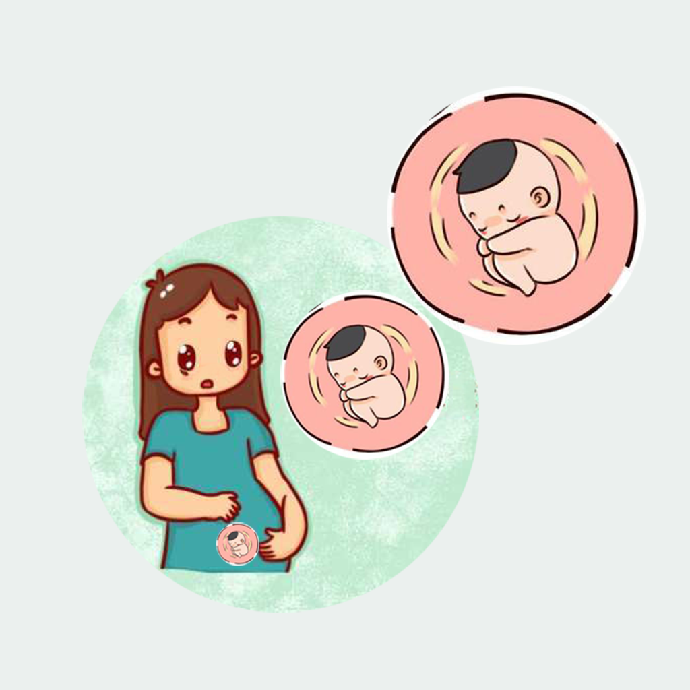

## Welcome to Pregnancy Fetal Movement Record

Fetal movement during pregnancy is a very wonderful and interesting thing, and mothers can feel the movement of the baby in the belly. For example, the baby is kicking in the mother's belly, and at the same time the baby can feel the touch of the mothers. This is a very happy and memorable thing for parents who desire to become moms and dads. You can record the frequency, feelings and time of your baby's fetus during pregnancy to share your joy with your family.

If you have any questions, you can either leave a message or send the questions to our email address.

We will answer them for you in the first time.

### Address: jichungan9498@163.com

Thank you!
